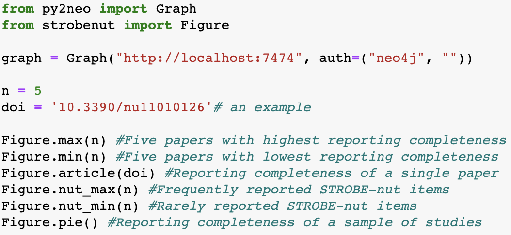

This repository includes:
1) one ontology for nutritional epidemiologic research. It was developed according to three well-developed standards agreed by the nutrition science community.
2) Python code to manage a graph database of nutritional epidemiologic papers.

# Ontology for Nutritional Epidemiology (ONE) 
### [Homepage](http://www.strobe-nut.org/content/strobe-nut-ontology) & [BioPortal](https://bioportal.bioontology.org/ontologies/ONE)

Nutritional epidemiology is a specific research area. The generic ontologies for food science, nutrition science or medical science failed to cover the specific characteristics of nutritional epidemiologic studies. As a result, we developed the ontology for nutritional epidemiology (ONE) in order to describe nutritional epidemiologic studies accurately.

# A Python module for the ONE
It has been tested in [Python](https://www.python.org/) v3.7.4 and [Neo4j](https://neo4j.com/) v3.5.6.

A Python module was developed to process content and STROBE-nut annotations of nutritional epidemiologic papers in XML format:
1) [Input.py](https://github.com/cyang0128/Nutritional-epidemiologic-ontologies/blob/master/imports/paper%20annotation%20(python)/Input.py): extract and store metadata of papers through the “Springer Nature API Portal” or in local XML files respectively; 
2) [Annotate.py](https://github.com/cyang0128/Nutritional-epidemiologic-ontologies/blob/master/imports/paper%20annotation%20(python)/Annotate.py): annotate the reporting completeness of papers according to the [STROBE-nut](https://www.strobe-nut.org/) reporting guidelines;
3) [Figure.py](https://github.com/cyang0128/Nutritional-epidemiologic-ontologies/blob/master/imports/paper%20annotation%20(python)/Figure.py): visualize the statistics of reporting completeness of papers; visualize the reporting frequency of the [STROBE-nut](https://www.strobe-nut.org/) items.

### Code
Please download the code under the folder ["strobenut"](https://github.com/cyang0128/Nutritional-epidemiologic-ontologies/blob/master/imports).

### Publications (ontology and graph database)
Yang, C.; Hawwash, D.; De Baets, B.; Bouwman, J.; Lachat, C. (2020) Perspective: Towards automated tracking of content and evidence appraisal of nutrition research. Advances in Nutrition. https://doi.org/10.1093/advances/nmaa057

Yang, C., De Baets, B., & Lachat, C. (2019). From DIKW pyramid to graph database: a tool for machine processing of nutritional epidemiologic research data. In 2019 IEEE International Conference on Big Data (Big Data) (pp. 5202–5205). Los Angeles, CA, USA: IEEE. https://doi.org/10.1109/bigdata47090.2019.9006469

Yang, C.; Ambayo, H.; De Baets, B.; Kolsteren, P.; Thanintorn, N.; Hawwash, D.; Bouwman, J.; Bronselaer, A.; Pattyn, F.; Lachat, C. (2019) An Ontology to Standardize Research Output of Nutritional Epidemiology: From Paper-Based Standards to Linked Content. Nutrients, 11, 1300. https://doi.org/10.3390/nu11061300

### Publications (data standards)
Pinart, M., Nimptsch, K., Bouwman, J., Dragsted, L. O., Yang, C., De Cock, N., Lachat, C., et al. (2018). Joint data analysis in nutritional epidemiology : identification of observational studies and minimal requirements. JOURNAL OF NUTRITION, 148(2), 285–297. https://doi.org/10.1093/jn/nxx037

Yang, C.; Pinart, M.; Kolsteren, P.; Van Camp, J.; De Cock, N.; Nimptsch, K.; et al.(2017) Perspective: Essential study quality descriptors for data from nutritional epidemiologic research. Advances in Nutrition, 8(5):639–51. https://doi.org/10.3945/an.117.015651

Lachat, C., Hawwash, D., Ocké, M. C., Berg, C., Forsum, E., Hörnel, A., Larsson, C., et al. (2016). Strengthening the Reporting of Observational Studies in Epidemiology-Nutritional Epidemiology (STROBE-nut): an extension of the STROBE Statement. PLOS MEDICINE, 13(6). https://doi.org/10.1371/journal.pmed.1002036

## License
 This work is licensed under a <a rel="license" href="http://creativecommons.org/licenses/by/4.0/">Creative Commons Attribution 4.0 International License</a>
